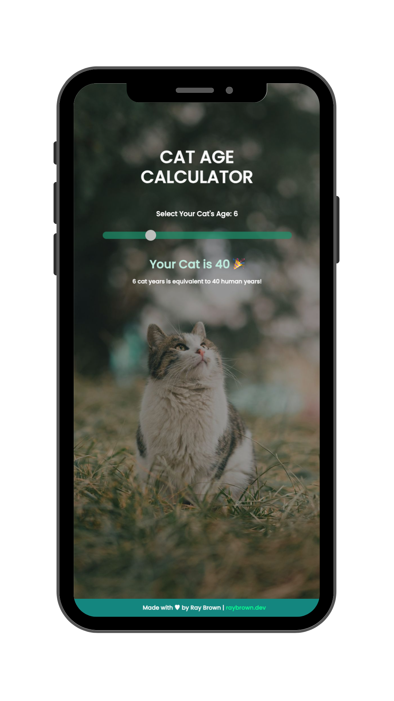

# Cat Age Calculator

  

The Cat Age Calculator is a simple web application that allows users to calculate the age of their cat in human years. It takes the age of the cat as input and provides the equivalent age in human years based on a predetermined life expectancy ratio.

## Game Preview
<!--  -->

## Features

- Interactive slider input for selecting the cat's age.
- Real-time calculation of the cat's age in human years.
- Stylish and responsive user interface.
- Support for breakpoints on the slider for easier selection.
- Clear visual feedback with output displayed dynamically.

## How to Play
1. Utilise the age scroller to input the age of your cat in years.
2. The application will dynamically compute and display the corresponding age in human years.
3. Upon each page reload, a random cat fact is displayed.
4. The cat facts are fetched from the [Cat Facts API](https://catfact.ninja).

## Usage

1. Open the `index.html` file in a web browser.
2. Use the slider to select the age of your cat.
3. The calculated age in human years will be displayed in real-time.

  <em>Thank you for checking out my project! 🚀</em>
   
  <em>Made with ♥ by Ray Brown </em>
  

