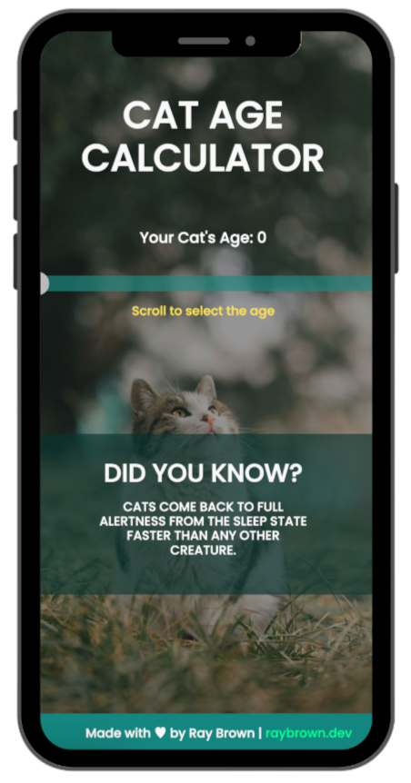

# Cat Age Calculator

The Cat Age Calculator is a simple web application that allows users to calculate the age of their cat in human years. It takes the age of the cat as input and provides the equivalent age in human years based on a predetermined life expectancy ratio.

## Features

- Interactive slider input for selecting the cat's age.
- Real-time calculation of the cat's age in human years.
- Stylish and responsive user interface.
- Support for breakpoints on the slider for easier selection.
- Clear visual feedback with output displayed dynamically.

## Technologies Used

- HTML: Provides the structure and content of the web page.
- CSS: Styles the elements and enhances the visual presentation.
- JavaScript: Implements the logic for calculating the cat's age.

## Usage

1. Open the `index.html` file in a web browser.
2. Use the slider to select the age of your cat.
3. The calculated age in human years will be displayed in real-time.

## How to Contribute

Contributions to the Cat Age Calculator project are welcome! If you'd like to contribute, please follow these steps:

1. Fork the repository.
2. Create a new branch (`git checkout -b feature/new-feature`).
3. Make your changes and commit them (`git commit -am 'Add new feature'`).
4. Push to the branch (`git push origin feature/new-feature`).
5. Create a new Pull Request and describe your changes.

